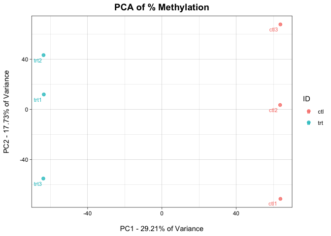
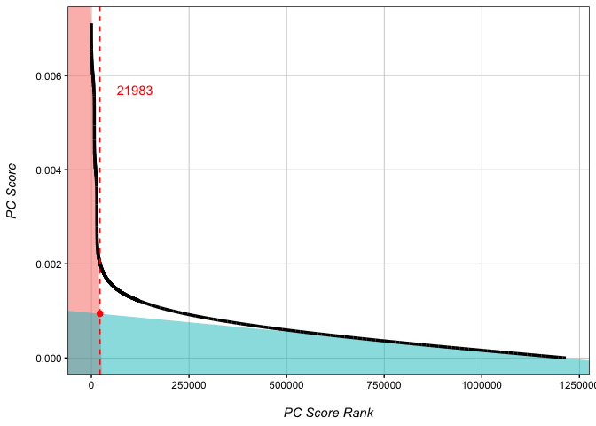
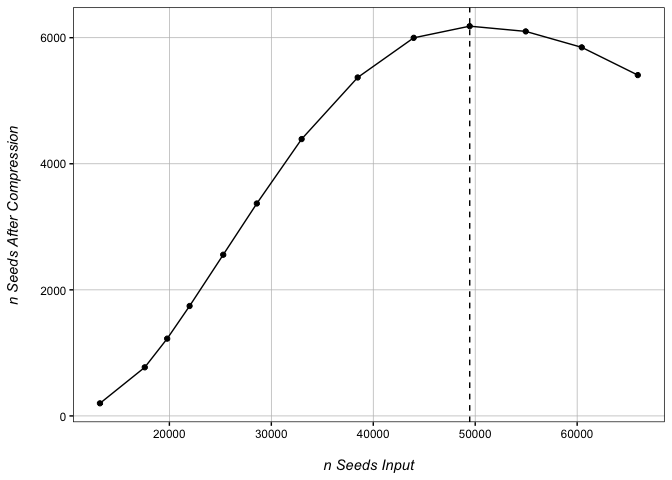

Eigenvector WGBS Analysis
================
Kathryn Lande
2024-02-29

Eigenvector WGBS analysis is built on the simple premise that in a
principle components analysis of all CpGs in a whole genome bisulfite
seq (WGBS) experiment, the eigenvector values of each CpG in the
principle component that best defines the treatment can be used as a
quantitative score for comparative analysis. Simply put: if a principle
component strongly delineates two conditions, then the contribution of a
single CpG to that principle component will be larger if that CpG is
highly different between conditions.

Eigenvector values are continuous, and allow for more flexible analyses
than those predicated on a p-value cut-off system. In comparison to
other common WGBS tools, Eigenvector analysis is generally faster. It
shows comparable ability to call differentially methylated loci (DMLs)
to current standard tools, and in test genomes is the most accurate
differentially methylated region (DMR) calling tool both in terms of the
number of DMRs called, as well as the size of DMRs called.

Currently, Eigenvector WGBS analysis is only set up to handle
comparisons of two-condition, one-factor experiments.

## Reading in our input file

We provide a script, Bismark2Matrix.R, that can be used to covert
Bismark outputed .cov files into the below format.

``` r
eigen <- read.delim("WGBS.txt")
eigen[1:5,1:5]
```

    ##           cpgID trt1_PercMeth trt1_nCpG trt2_PercMeth trt2_nCpG
    ## 1 chr1:10000000     0.3846154        65     0.5769231        78
    ## 2 chr1:10000007     0.5915493        71     0.4457831        83
    ## 3 chr1:10000019     0.5773196        97     0.4782609        46
    ## 4  chr1:1000002     0.6363636        66     0.6931818        88
    ## 5 chr1:10000028     0.4218750        64     0.3898305        59

##### 

## Defining our best principle component

Here we identify which principle component (PC) best defines the
difference between treatment and control. If multiple PCs delineate the
conditions, the PC contributing the most variance will be chosen.

``` r
DefineBestPC(eigen, IDs = c("trt", "ctl")) # IDs segregate two conditions based on a common identifier in the column names of the eigen dataframe, rather than by column number. You may have to rename the columns of your input object if no common name exists.
```

    ## 
    ## Best PC to use is PC1 with a sample distance of  221, representing 29.21% of the total variance.

<!-- -->

## Score each CpG by its eigenvector value

As PC1 was defined as our best PC, we should set PC=1 The first
condition in the IDs=c() option will always be treated as the treatment.
Positive eigenvector scores (PC_Score) mean that there is increased
methylation in the treatment condition (hypermethylation), whereas
negative eigenvector scores indicate decreased methylation in the
treatment condition (hypomethylation).

``` r
getPCRanks(eigen, IDs = c("trt", "ctl"), PC = 1) -> ranks # Get an eigenvector score for each CpG based on principle component 1
head(ranks)
```

    ##                    PC_Score
    ## chr1:10000000  0.0011814371
    ## chr1:10000007  0.0002623601
    ## chr1:10000019  0.0008969914
    ## chr1:1000002   0.0003490072
    ## chr1:10000028 -0.0007432355
    ## chr1:10000035  0.0007022953

## Identifying a DML cut-off

Eigenvector analysis does not assign p-values to individual CpGs.
However, in test datasets, score-based cut-offs show comparable ability
to define true DMLs as other tools that do assign p-values. We offer
functionality to define a cut-off score for differential
vs. non-differential DMLs, though note that this type of analysis is not
the primary function of eigenvector analysis.

``` r
rankDist(ranks, mode="intersect") # Two modes "intersect" and "strict"
```

    ## Estimated rank cut-off for significant CpGs is 21983.

<!-- -->

Generally speaking, the best cut-off rank occurs just above the
inflection point of the plot of Absolute Rank vs. Absolute Score. The
cut-off can be estimated manually from the plot, or the rankDist()
function can be used to estimate the cutoff as above. rankDist() offers
two modes. The “intersect” method defines the cut-off as the
intersection between the linear line of best fit for the highest scoring
CpGs (true variation), and the that of the lowest scoring CpGs
(background noise). Alternatively, the “strict” method defines the
cut-off simply as half the distance between the maximum rank used to
define the line of best fit for the highest scoring CpGs and the value
produced by intersect mode.

In high variability test genomes, PC-strict and PC-intersect perform
comparably to each other and other softwares. In low-variability test
genomes, PC-strict greatly out preforms PC-intersct as well as all other
tested softwares in false positive reduction, though this comes at the
cost of a slight increase in false negative calls. Generally, PC-Strict
is better in comparisons where the expected number of true DMLs is
relatively low.

Please note that these are simply estimations. If the predicted cut-off
returned is much higher or much lower than the inflection point as
demonstrated in the figure above, it is recommended to select a cut-off
rank manually.

``` r
DMLs <- addRanks(ranks) # add rank order to our CpGs
DMLs$significant <- DMLs$abs.order <= 21983 # significant CpG cut-off defined by rankDist() is: 21983
head(DMLs)
```

    ##                  PC_Score   order abs.order  chr     pos significant
    ## chr1:9676127  0.007111105       1         1 chr1 9676127        TRUE
    ## chr1:8652821  0.007058246       2         2 chr1 8652821        TRUE
    ## chr3:30403    0.007021848       3         3 chr3   30403        TRUE
    ## chr2:3271955  0.007012772       4         4 chr2 3271955        TRUE
    ## chr2:350869  -0.006987694 1215093         5 chr2  350869        TRUE
    ## chr1:9060703 -0.006984474 1215092         6 chr1 9060703        TRUE

We now have a file with a significance for all CpGs.

## Calling DMRs

Differentially methylated region (DMR) calling is where eigenvector
analysis shines. In simulated genomes, the eigenvector-based DMR calling
system has the lowest false call rate compared to other tested softwares
(false positive + false negative). Basepair for basepair, most other DMR
callers dramatically over predict the size of DMR regions compared to
the present method.

Our DMR calling algorithm works by defining a rank cut-off, wherein CpGs
below this rank are extracted as seeds. Nearby CpGs are collapsed into
single seed points at their median. The function expands outwards from
each seed point up to a maximum DMR size, then identifies the smallest
expansion containing over 90% of the most variable CpGs

##### DMR calling occurs in two steps:

``` r
find_best_nSeed(ranks, 21983) # (1) identifying the optimal number of seeds to use 
```

    ## 
    ## Checking 13 seed values for best DMR calling............. done!

    ## 
    ## Overcompression begins around nSeed=49461. This is an optimal seed number for DMR calling.

<!-- -->

``` r
# 49461 seeds is the optimal value
DMRs <- Get_Novel_DMRs(ranks, 49461, DMR_resolution=200, minCpGs=10) # (2) call DMRs based on the optimal seed number
```

    ## Splitting data by chromosome...

    ## Bootstrapping background distributions for each chromosome...

    ## Compressing nearby seeds...

    ## done! Collapsed 49461 seeds to 6183 seeds!

    ## 
    ## Expanding DMRs from 6183 seeds...

    ## 
    ## Trimming 6183 DMRs... done!

``` r
head(DMRs[order(DMRs$FDR, decreasing = F),])
```

    ##         Chr   Start     End DMR_Zscore nCpGs             p DMR_size
    ## 112176 chr3 2930037 2933861  208.92825   571 9.475993e-138     3824
    ## 10355  chr3 3710015 3713724  146.91840   525 1.778992e-136     3709
    ## 112760 chr2 2560012 2563779  189.98662   542 4.658351e-136     3767
    ## 10391  chr2  280030  283577 -281.12965   520 3.408374e-132     3547
    ## 112380 chr3 4720022 4723800  -71.81773   566 1.924809e-130     3778
    ## 10549  chr2 6050082 6053433  285.29007   488 1.922404e-127     3351
    ##                  FDR
    ## 112176 5.859007e-134
    ## 10355  1.099773e-132
    ## 112760 2.879327e-132
    ## 10391  2.106375e-128
    ## 112380 1.189339e-126
    ## 10549  1.187661e-123

## Score pre-defined regions

Eigenvector scores allow users to directly quantify methylation
differences across pre-defined regions such as TSSs, enhancers, or other
regions of interest. We offer functionality to assess these regions
directly, rather than by querying novel DMR calls for overlaps.

``` r
# Make a dataframe of regions to check:
regions <- data.frame(chr=c("chr3", "chr2", "chr1"),
                      s=c(2930037, 280330, 300000),
                      e=c(2933861, 283677, 300500),
                      ID=c("Hyper-DMR", "partial Hypo-DMR", "random"))

getRegionScores(DMLs, regions)
```

    ##            feature        meanPC nCpG          Z             p
    ## 1        Hyper-DMR  0.0040436213  571  4.4796557 2.507733e-141
    ## 2 partial Hypo-DMR -0.0040839277  476 -4.5397388 1.094712e-120
    ## 3           random -0.0003210901   24 -0.3640006  6.040479e-01

getRegionScores returns the mean eigenvector scores for each input
region, as well as Z-score against the background, and a p-value.
