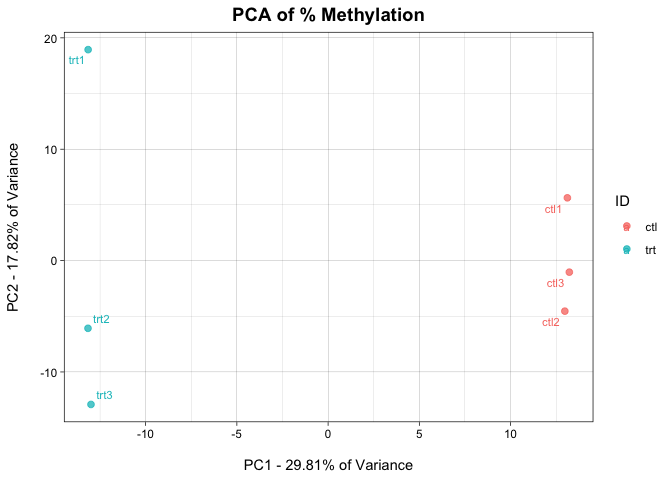
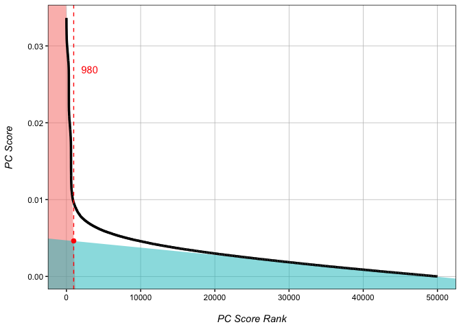
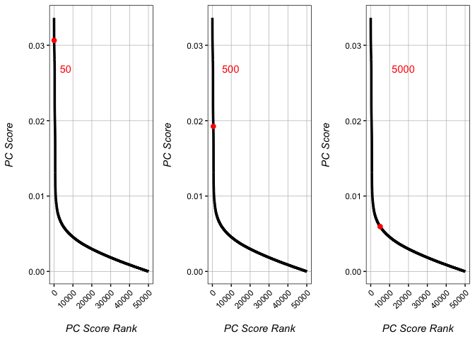
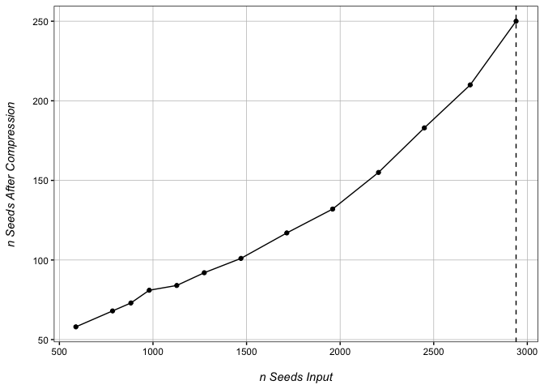
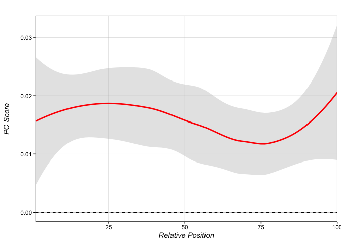
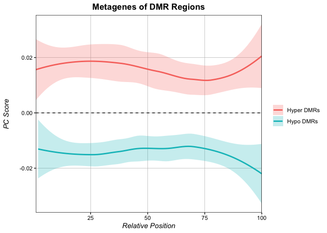

Eigenvector WGBS Analysis
================
Kathryn Lande
2024-02-29

Eigenvector WGBS analysis is built on the simple premise that in a
principle components analysis of all CpGs in a whole genome bisulfite
seq (WGBS) experiment, the eigenvector values of each CpG in the
principle component that best defines the treatment can be used as a
quantitative score for comparative analysis. Simply put: if a principle
component strongly delineates two conditions, then the contribution of a
single CpG to that principle component will be larger if that CpG is
highly different between conditions.

Eigenvector values are continuous, and allow for more flexible analyses
than those predicated on a p-value cut-off system. In comparison to
other common WGBS tools, Eigenvector analysis is generally faster. It
shows comparable ability to call differentially methylated loci (DMLs)
to current standard tools, and in test genomes is the most accurate
differentially methylated region (DMR) calling tool both in terms of the
number of DMRs called, as well as the size of DMRs called.

Currently, Eigenvector WGBS analysis is only set up to handle
comparisons of two-condition, one-factor experiments.

``` r
# install PCBS using devtools
if(!require(PCBS)){ devtools::install_github("katlande/PCBS") }
library(PCBS)
```

## Reading in our input file

We provide a script, Bismark2Matrix.R, that can be used to covert
Bismark outputed .cov files into the below format.

``` r
eigen <- read.delim("WGBS.txt") # https://github.com/katlande/PCBS/WGBS.txt
eigen[1:5,1:5]
```

    ##          cpgID trt1_PercMeth trt1_nCpG trt2_PercMeth trt2_nCpG
    ## 1 chr2:2505718     0.5581395        43     0.4084507        71
    ## 2 chr2:1807326     0.5652174        69     0.4883721        43
    ## 3 chr2:2490208     0.4489796        49     0.5416667        72
    ## 4 chr2:5512828     0.5263158        38     0.6315789        19
    ## 5 chr3:1296629     0.6000000        35     0.4242424        66

##### 

## Defining our best principle component

Here we identify which principle component (PC) best defines the
difference between treatment and control. If multiple PCs delineate the
conditions, the PC contributing the most variance will be chosen.

``` r
DefineBestPC(eigen, IDs = c("trt", "ctl")) # IDs segregate two conditions based on a common identifier in the column names of the eigen dataframe, rather than by column number. You may have to rename the columns of your input object if no common name exists.
```

    ## 
    ## Best PC to use is PC1 with a sample distance of 45.4, representing 29.81% of the total variance.

<!-- -->

## Score each CpG by its eigenvector value

As PC1 was defined as our best PC, we should set PC=1 The first
condition in the IDs=c() option will always be treated as the treatment.
Positive eigenvector scores (PC_Score) mean that there is increased
methylation in the treatment condition (hypermethylation), whereas
negative eigenvector scores indicate decreased methylation in the
treatment condition (hypomethylation).

``` r
getPCRanks(eigen, IDs = c("trt", "ctl"), PC = 1) -> ranks # Get an eigenvector score for each CpG based on principle component 1
head(ranks)
```

    ##                   PC_Score
    ## chr2:2505718  3.781088e-05
    ## chr2:1807326  4.573342e-04
    ## chr2:2490208  3.156102e-03
    ## chr2:5512828 -5.695585e-03
    ## chr3:1296629  2.822282e-03
    ## chr3:3212276 -6.044066e-03

## Identifying a DML cut-off

Eigenvector analysis does not assign p-values to individual CpGs.
However, in test datasets, score-based cut-offs show comparable ability
to define true DMLs as other tools that do assign p-values. We offer
functionality to define a cut-off score for differential
vs. non-differential DMLs, though note that this type of analysis is not
the primary function of eigenvector analysis.

``` r
rankDist(ranks, mode="intersect") # Two modes "intersect" and "strict"
```

    ## Estimated rank cut-off for significant CpGs is 980.

<!-- -->

Generally speaking, the best cut-off rank occurs just above the
inflection point of the plot of Absolute Rank vs. Absolute Score. The
cut-off can be estimated manually from the plot, or the rankDist()
function can be used to estimate the cutoff as above. rankDist() offers
two modes. The “intersect” method defines the cut-off as the
intersection between the linear line of best fit for the highest scoring
CpGs (true variation), and the that of the lowest scoring CpGs
(background noise). Alternatively, the “strict” method defines the
cut-off simply as half the distance between the maximum rank used to
define the line of best fit for the highest scoring CpGs and the value
produced by intersect mode.

In high variability test genomes, PC-strict and PC-intersect perform
comparably to each other and other softwares. In low-variability test
genomes, PC-strict greatly out preforms PC-intersct as well as all other
tested softwares in false positive reduction, though this comes at the
cost of a slight increase in false negative calls. Generally, PC-Strict
is better in comparisons where the expected number of true DMLs is
relatively low.

Please note that these are simply estimations. If the predicted cut-off
returned is much higher or much lower than the inflection point as
demonstrated in the figure above, it is recommended to select a cut-off
rank manually.

``` r
DMLs <- addRanks(ranks) # add rank order to our CpGs
DMLs$significant <- DMLs$abs.order <= 980 # significant CpG cut-off defined by rankDist() is: 980
head(DMLs)
```

    ##                 PC_Score order abs.order  chr     pos significant
    ## chr3:3291453  0.03364091     1         1 chr3 3291453        TRUE
    ## chr3:31670    0.03343012     2         2 chr3   31670        TRUE
    ## chr3:3082482  0.03337153     3         3 chr3 3082482        TRUE
    ## chr2:350483  -0.03296202 50000         4 chr2  350483        TRUE
    ## chr1:8652017  0.03291018     4         5 chr1 8652017        TRUE
    ## chr3:4531184 -0.03270712 49999         6 chr3 4531184        TRUE

We now have a file with a significance for all CpGs.

## Identifying a DML cut-off manually

In some cases, the cut-off predicted by getPCRanks may look imperfect.
In such cases, cut-off values can be tested manually:

``` r
test_50 <- checkRank(ranks, 50) # set cut-off to 50
test_500 <- checkRank(ranks, 500) # set cut-off to 500
test_5000 <- checkRank(ranks, 5000) # set cut-off to 5000
gridExtra::grid.arrange(test_50+tilt(), test_500+tilt(), test_5000+tilt(), nrow=1)
```

<!-- -->

## Calling DMRs

Differentially methylated region (DMR) calling is where eigenvector
analysis shines. In simulated genomes, the eigenvector-based DMR calling
system has the lowest false call rate compared to other tested softwares
(false positive + false negative). Basepair for basepair, most other DMR
callers dramatically over predict the size of DMR regions compared to
the present method.

Our DMR calling algorithm works by defining a rank cut-off, wherein CpGs
below this rank are extracted as seeds. Nearby CpGs are collapsed into
single seed points at their median. The function expands outwards from
each seed point up to a maximum DMR size, then identifies the smallest
expansion containing over 90% of the most variable CpGs

##### DMR calling occurs in two steps:

``` r
find_best_nSeed(ranks, 980) # (1) identifying the optimal number of seeds to use 
```

    ## 
    ## Checking 13 seed values for best DMR calling............. done!

<!-- -->

``` r
# Since no over-compression is detected, we can simply use the largest seed value tested - 2940 (980 x 3)
DMRs <- Get_Novel_DMRs(ranks, 2940, DMR_resolution=200, minCpGs=10) # (2) call DMRs based on the optimal seed number
```

    ## 
    ## Trimming 135 DMRs... done!

``` r
head(DMRs[order(DMRs$FDR, decreasing = F),])
```

    ##      Chr   Start     End DMR_Zscore nCpGs            p DMR_size          FDR
    ## 114 chr3 4920450 4923267  -38.49148    24 8.033948e-08     2817 2.892221e-06
    ## 97  chr3 4140014 4142951  -24.38989    25 1.087796e-07     2937 3.807287e-06
    ## 93  chr3 1340221 1342791  -25.60886    23 1.242983e-07     2570 4.226143e-06
    ## 57  chr1 8650728 8652017   62.98847    13 2.846637e-06     1289 9.393903e-05
    ## 125 chr3 3960576 3962805   14.09448    14 6.455052e-06     2229 2.065617e-04
    ## 78  chr3 5080015 5081519  -32.16005    10 1.816110e-05     1504 5.629942e-04

## Score pre-defined regions

Eigenvector scores allow users to directly quantify methylation
differences across pre-defined regions such as TSSs, enhancers, or other
regions of interest. We offer functionality to assess these regions
directly, rather than by querying novel DMR calls for overlaps.

``` r
# Make a dataframe of regions to check:
regions <- data.frame(chr=c("chr3", "chr3", "chr1"),
                      s=c(4920450, 3961576, 300000),
                      e=c(4923267, 3963805, 302900),
                      ID=c("Hypo-DMR", "partial Hyper-DMR", "random"))

getRegionScores(DMLs, regions)
```

    ##             feature       meanPC nCpG          Z            p
    ## 1          Hypo-DMR -0.020963435   24 -4.6693669 3.782263e-08
    ## 2 partial Hyper-DMR  0.008092709    8  1.7937726 8.985269e-06
    ## 3            random -0.003612135    8 -0.8098088 1.589533e-02

getRegionScores returns the mean eigenvector scores for each input
region, as well as Z-score against the background, and a p-value. As you
can see in our test set, true DMRs and regions partially overlapping
true DMRs are significant, whereas random regions do not show
enrichment.

## Metagenes

We also provide functionality for generating metagenes over a set of
regions based on PC Scores. In these figures, values above 0 represent
regions where the treatment group is hypermethylated, while values below
0 represent hypomethylated regions.

##### Make a metagene from the significant hypermethylated DMRs:

``` r
hyper_DMRs <- DMRs[DMRs$FDR <= 0.05 & DMRs$DMR_Zscore > 0,] # Select all significantly hypermethylated DMRs
regions_hyper <- hyper_DMRs[c(1:3)] # select chrom, start, and end of all hyper DMRs
score_metagene(ranks, regions_hyper)
```

<!-- -->

Our hypermethylated DMR regions broadly show a highly positive PC-score
across the regions. This is what we expect for hypermethylated regions.

##### Plot metagenes of multiple regions together

``` r
# Let's plot the metagene of the hyper-DMRs and hypo-DMRs together on the same plot..

hypo_DMRs <- DMRs[DMRs$FDR <= 0.05 & DMRs$DMR_Zscore < 0,] # Select all significantly hypermethylated DMRs
regions_hypo <- hypo_DMRs[c(1:3)] # select chrom, start, and end of all hyper DMRs

# Setting return.data = T will cause score_metagene to return raw data instead of a plot
hyper_metagene <- score_metagene(ranks, regions_hyper, return.data = T)
hypo_metagene <- score_metagene(ranks, regions_hypo, return.data = T)

# The multiple_metagenes function plots multiple metagenes using a list of raw data objects from score_metagene().
multiple_metagenes(data_list = list(hyper_metagene, hypo_metagene), # list of raw data
                   set_names = c("Hyper DMRs", "Hypo DMRs"), # names for elements of the data_list list
                   title="Metagenes of DMR Regions", legend.title = F)
```

<!-- -->

As expected, our hypo-DMRs show very negative PC-score across the
regions.
